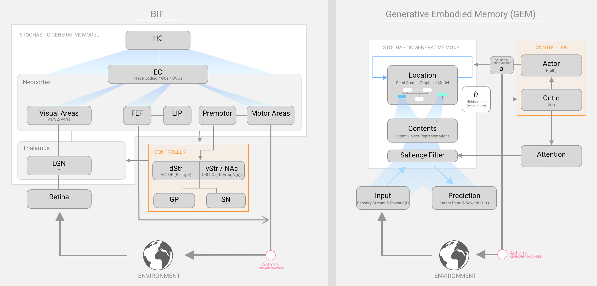
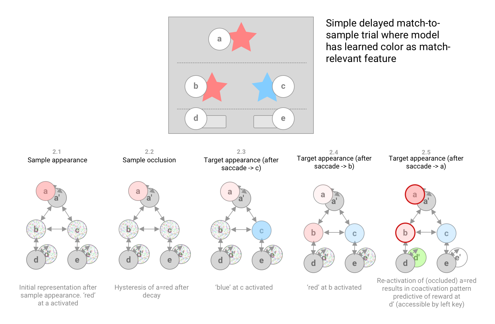

# Generative Embodied Memory (GEM)

Below is our Working Memory model description submitted for the [2020 WBAI Modelathon](https://wba-initiative.org/en/15968/).

*Figure 1. Illustration of our computational model (right) next to a high level BIF diagram (left).*

The BIF file is shared as a [Google Sheet](https://docs.google.com/spreadsheets/d/1raTYA_x-xHLDhTCkVxzkSY2SE6Jf-EmvJvHKVQWD6hI/edit?usp=sharing) and as a [spreadsheet](GEM_WMHackathon2020_BIF.xlsx) in this repo.

## Working Memory as an (Embodied) Generative Model

Solving classical WM tasks such as delayed match-to-sample and related problems requires an agent to learn a compressed (energetically efficient) generative model of the environment that, by learning transitions (both controllable and uncontrollable), can anticipate the consequences of correlated motor activity. Due to the non-Markovian nature of the world, such an ability requires the selection and maintenance of representations even after they are occluded from sensors (e.g. the representation of a predator behind a bush). 

We propose a model of working memory (WM) as an inherent function of the internal generative model proposed by frameworks such as Active Inference [5]. We are inspired by recent work proposing the that allocentric location-coding of space (both spatial and abstract) may be a central function of the cortical-entorhinal circuit [4, 7]. Additionally, we are compelled by suggestions that corollary discharge may enable the use of embodied action (both overt and covert/abstract) to traverse the model [6] and aid recall of useful content. Such an action-oriented perspective is suggested by evidence (e.g. that from literature on Action Simulation [8]) demonstrating the ubiquitous recruitment of the motor system in, among other things, planning and goal-directed behavior. A wide range of examples can be found in behavioral psychology experiments showing the use of eye movement (and therefore the oculomotor system) in tasks requiring recall and the generation of visual imagery from memory [9, 10].

<!-- Such a generative model need not be distinct from that involved in many other cognitive activities including perception, habit learning, and mental simulation. -->

<!--Due to the well-documented capacity limitations of WM, this generative model must compress a high-dimensional space of temporally evolving stimuli into a parsimonious representation optimized for transformation, composition and relational reasoning. 
-->
By pairing the generative model with a controller leveraging corollary discharge to run queries (e.g. single or multi-step rollouts or counterfactual experiments) through this spatially coded memory, we believe a flexible model of WM may be achieved.

## Model Description

We detail these two main components of our model, Generative Emdobied Memory (GEM), below. In *italics*, we discuss an example of potential functionality of the component in the context of the delayed match-to-sample task. Where applicable, we denote hypothesized biological analogs in [brackets].

### Stochastic Generative Model [Neocortex & MTL]

The SGM is an action conditioned predictive autoencoder that learns a representation of salient agent-environment dynamics. As a predictive autoencoder, this model generates predictions for latent state, and possibly lower level sensory activity, at the next time step. These predictions are informed by corollary discharge from motor (and higher) areas allowing the SGM to produce predictions based not only on ongoing actions but simulated actions received from the controller. Importantly, the model is also stochastic, such that on each generative cycle (that some hypothesize may align with a hippocampal theta ryhtm [6]), a unique prediction is sampled from the joint distribution made available as output. This stochasticity allows the model to indicate ambiguity or competition between mutually exclusive hypotheses by generating highly varying outputs, whereas highly consistent samples indicate confidence. This ability of the model to convey a measurable ambiguity metric is critical in providing feedback to the controller driven by a search for opportunities for model improvement (defined as ambiguity reduction in the generative model).

The SGM maintains its representation as a hidden state (`h`) partitioned into two paired sub-components: a location sub-component and a content sub-component.

#### Location Layer [Entorhinal cortex and sub-granular cortical layers]

The location sub-component functions as a cognitive map or graphical model that stores the location of sensors (e.g. the fovea) in the reference frame of the environment as suggested by [4]. The neural representation of 2D space may employ coding schemes inspired by grid cells, border cell, object vector cells and others, found primarily in medial entorhinal cortex (MEC). Critically, the location sub-component represents not just spatial locations but the structure of the environment and the motor sequences or abstract action-transformations required to traverse it. It is modelled as a recurrent neural network (RNN) which takes the present network state and an action and outputs the next network state (representing an adjacent and accessible state in abstract location space). 

*In the match-to-sample task, this component might represent potential task-salient foveal positions on the screen, such as a) top sample zone, b) left target, c) right target, as well as the spatial relationships between them. Once trained, the RNN might learn: `RNN(right target, saccade left) = left target`. Importantly, the space of locations need not be constrained to a spatial 2D map, e.g. to states accessible via learned action affordances such as key presses at d leading to d', or the occlusion transformation between a and a' (see Figure 2).*

#### Content Layer [Granular cortical layers]

The content sub-component encodes a latent representation of objects in the world at a particular location encoded by the location sub-component. Importantly, this layer may store multiple mutually exclusive features when representational uncertainty is present. Local inhibition and competition during each generative cycle enables sampling from independent sub-groups of mutually consistent features. Activations in this layer are subject to a decay rate, resulting in a useful hysteresis of previously observed content information.

Additionally, an attentional mechanism filters inputs to ensure only task-relevant features are stored into and read out of the content layer's representation.

*Content, in the DMS task, is a temporal extension of present stimuli allowing for the representation of not only the visual symbol appearing at a location, but those anticipated to appear. Additionally, a hysteresis in the content layer enables the maintenance of the sample stimulus through the occlusion period. The representation of content is compressed by removing spurious features that result in generative model prediction errors (e.g. symbol shape in our color-based DMS task). See Figure 2 for an example timeseries of content representations.*

### Controller [Basal Ganglia]

The Controller serves to query the generative model with candidate actions (whether overt or covert) in search of opportunities for model improvement or increased expected reward. 

Based on a variant of the neural Actor-Critic model of striatal function [2], the actor [dorsal Striatum] learns a probabalistic policy mapping the SGM's hidden state to actions. The critic [ventral Striatum / Nucleus Accumbens] maintains an estimate of expected discounted reward conditioned on `h`.

While the policy is being learned, action ambiguity is resolved by the controller by running a sampling process. On each generative cycle `i`:

* A candidate action `a_i` is sampled from the policy
* This candidate action is passed to the generative model (corollary discharge)
* The model returns a predicted successor hidden state `h_i(t+1)`
* The successor is evaluated by the critic to produce a value estimate `v_i = V(h_i(t+1))`, which is attributed and integrated into the candidate `a_i` through a Hebbian association rule.

Sampling continues until an estimated value threshold is achieved, at which point the winning action is executed. In this way, the policy learns to reduce model ambiguity (e.g. the content uncertainty at location a) while maximizing expected value. Once a successful policy is learned the controller is able to generate habitized (model-free) actions with less dependence on sampling of the generative model. 

The two components of the controller are trained in parallel to produce action trajectories (traversals through location-content space) that result in cumulative representations assigned high value by the critic.

*In the DMS task, actions may be defined as discrete saccadic outputs (e.g. left, right, up, down), and an optional keyboard command (e.g. left key, right key), as well as learned abstract action-transformations. In a simple trial of the task where color is the match-relevant symbol feature, the critic will learn to map the matched content representation (a ~= b) to high estimates of expected value (as shown in Figure 2.5). In parallel, the policy learns sensorimotor trajectories such as {a (red), a', b (red), a', a (red)}, which results in a hidden state that is easily exploited by a deterministic policy (`Pi(a=red, b=red) = left key`) and assigned a high value estimate by the critic.*

*Figure 2. Illustration of trivial delayed match-to-sample trial, and associated hidden state representation. Node overlays represent content activated at each location. The colored noise overlay represents content ambiguity. Note that content at button locations d & e are never ambiguous, but post-keypress locations d' and e' are ambiguous until the a-b match is identified.*

## Delayed Match-to-Sample Task Modelling Walk-through

Here we walk through our cartoon example of hypothetical location and content representations during the DMS task in further detail. Key states of the learned representation are illustrated in Figure 2.

### Sample Appearance (Figure 2.1)

In stage 1 of the DMS task, upon appearance of the sample symbol, the untrained generative model recruits a compressed representation of the stimulus (e.g. coding color, shape, or other characteristics), associated with its allocentric location in the reference frame of the environment. Saccadic exploration around the screen provides self-supervised training validating the accuracy of the generative model to predict incident visual sensory data. We note that trivial geometries can be quickly encoded without much visual exploration, but more complex unfamiliar stimuli like those used in [the DMS task from Cambridge Cognition](https://www.youtube.com/watch?v=nd2luWobxYE&feature=emb_title) likely require the generation of a spatial sensorimotor representation at the scale of the symbol (e.g. saccade down -> orange brick pattern, saccade up -> white zigzags).

### Sample Occlusion (Figure 2.2)

After several training rounds, the deterministic disappearance of the sample is learned by the generative model such that the representation of the sample successfully predicts the transition to a blank screen. Though sensory data from the sample symbol is no longer available, hysteresis in the content representation maintains the sample symbol's representation at a, which decays over time. While the occlusion transition `a -> a'` does not correlate with overt motor activity like other spatial transitions, we hypothesize that repeated exposure to predictable (in this case precisely timed) transitions will learn to recruit an abstract representation of the transformation in much the same way, perhaps using corollary discharge from non-motor areas. 

### Target Appearance (Figure 2.3)

The untrained model will again receive prediction-error spikes during the unexpected appearance of targets. The trained generative model, however, learns to anticipate the invariant aspects of the post-occlusion transition -- two symbols at specific locations in the middle of the screen. Correlations identified between content at the sample figure's location, and content at the two target locations, may allow the model to produce more specific visual predictions, e.g. a blue sample may elicit predictions biased towards blue target symbols. At this stage, uncorrelated dimensions of the content representation (those that do not aid prediction accuracy) may be unlearned. For example, in a task where matches are based only on color, and target shapes are fully random, generated predictions of shape at target locations will on average result in prediction errors, thus attenuating the activity of shape features in the representation.

### Saccadic Exploration (Figure 2.4)

The untrained model will initially employ a stochastic policy to produce both oculomotor outputs as well as key presses. The controller's policy outputs action probabilities conditioned on the model's hidden state. Over time, we expect the model to learn a policy that routinely visits (and therefore reduces ambiguity at) locations b & c, and revisits a and a' (if the sample representation has sufficiently decayed) to reactivate a complete pattern-matched hidden state recognized by the critic. Overt saccades to a' may help serve to amplify the reactivation of decayed representation at a.

### Keyboard Response & Trial Feedback (Figure 2.5)

Initial learning will uncover the basic value of key presses occurring after target appearance (expected reward ~ 0.5). With further training, however, the controller will identify hidden states with higher value, e.g. those where content representations at the sample location and one target location are sufficiently similar. After sufficient visual exploration to achieve one of these states, the policy will generate the proper key press.

Finally, visual feedback communicates the outcome (reward or no reward) to the model. Hippocampal replay post-feedback (simulated rollouts through recently active states in the SGM) may faciliate updates to the controller and generative model.

## License

This work is licensed under a
[Creative Commons Attribution 4.0 International License][cc-by].

[![CC BY 4.0][cc-by-image]][cc-by]

[cc-by]: http://creativecommons.org/licenses/by/4.0/
[cc-by-image]: https://i.creativecommons.org/l/by/4.0/88x31.png

## References

1. Treisman, A. (1996). The binding problem. Current opinion in neurobiology, 6(2), 171-178.
2. Takahashi, Y., Schoenbaum, G., & Niv, Y. (2008). Silencing the critics: understanding the effects of cocaine sensitization on dorsolateral and ventral striatum in the context of an actor/critic model. Frontiers in neuroscience, 2, 14.
3. Knudsen, E. I. (2007). Fundamental components of attention. Annu. Rev. Neurosci., 30, 57-78.
4. Lewis, M., Purdy, S., Ahmad, S., & Hawkins, J. (2019). Locations in the neocortex: A theory of sensorimotor object recognition using cortical grid cells. Frontiers in Neural Circuits, 13, 22.
5. Tschantz, A., Seth, A. K., & Buckley, C. L. (2020). Learning action-oriented models through active inference. PLoS computational biology, 16(4), e1007805.
6. Buzsáki, G., & Moser, E. I. (2013). Memory, navigation and theta rhythm in the hippocampal-entorhinal system. Nature neuroscience, 16(2), 130-138.
7. Høydal, Ø. A., Skytøen, E. R., Andersson, S. O., Moser, M. B., & Moser, E. I. (2019). Object-vector coding in the medial entorhinal cortex. Nature, 568(7752), 400-404.
8. Pezzulo, G., Candidi, M., Dindo, H., & Barca, L. (2013). Action simulation in the human brain: twelve questions. New Ideas in Psychology, 31(3), 270-290.
9. Yoon, D., & Narayanan, N. H. (2004, March). Mental imagery in problem solving: An eye tracking study. In Proceedings of the 2004 symposium on Eye tracking research & applications (pp. 77-84).
10. Thomas, L. E., & Lleras, A. (2007). Moving eyes and moving thought: On the spatial compatibility between eye movements and cognition. Psychonomic bulletin & review, 14(4), 663-668.